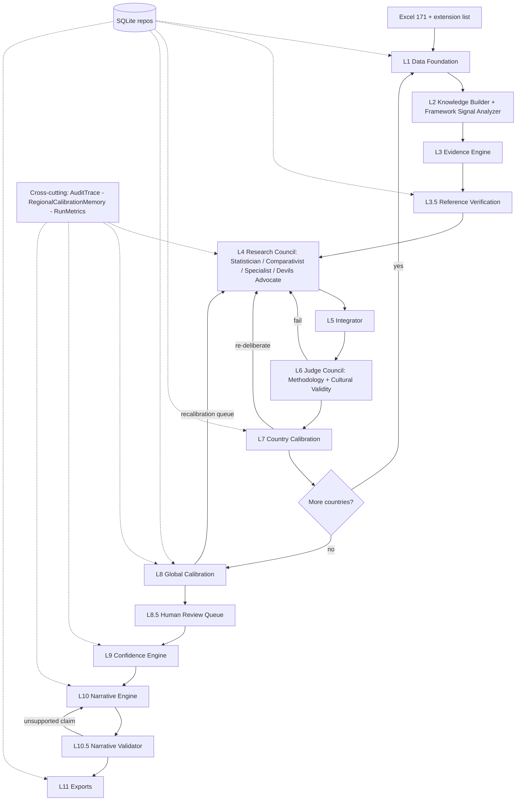

# FOLK AI Council System — Implementation Plan (Architecture Frozen)

Evidence-centric cultural-intelligence scoring. The central artifact is `CountryKnowledgePack`, and its core is the `FrameworkSignal` ("common signal across five frameworks"). Every final score is traceable: Framework Data -> Framework Signals -> Knowledge Pack -> Evidence -> Reference Verification -> Council Deliberation -> Integration -> Judgement -> Country Calibration -> Global Calibration -> Confidence -> Narrative -> Output.

## Non-negotiable methodological principle
This system is NOT a chatbot debate platform — it is a **cultural research workflow**. The fixed hierarchy `Framework Data -> Framework Signals -> Knowledge Pack -> Evidence -> Council Deliberation -> Integration -> Judgement -> Calibration -> Narrative -> Website Profile` must be preserved in every implementation decision. The council exists to evaluate evidence; evidence exists to evaluate framework signals; framework signals originate from the statistical synthesis of Hofstede, GLOBE, Schwartz, WVS, and Trompenaars.

## Source of Truth (authoritative documents — encode their intent, do not reinterpret)
- `Docs/FOLK_AI_Council_System_Brief.docx` — the technical build brief (council model, hard rules, tiers, extension protocol, reference logging, calibration run).
- `Docs/Cultural_Intelligence_Framework.docx` + `Docs/Cultural_Dimensions_Framework_Note_1.txt` — the intellectual framework. Encoded as constants/guardrails:
  - Goal is the **common signal across Hofstede/GLOBE/Schwartz/WVS/Trompenaars**, built bottom-up from factor analysis; maintain source-framework -> FOLK traceability.
  - **D1 Identity** (Self<->Social): strongest, most stable.
  - **D2 Expression** (Open<->Restrained): Open != extroverted; Restrained != unfriendly.
  - **D3 Structure** (Certain<->Fluid): psychological comfort with ambiguity, NOT governance/rule-of-law quality.
  - **D4 Drive** (Striving<->Accepting): what a culture values, NOT individual work ethic.
  - **Uneven anchoring**: `DIMENSION_ANCHOR_STRENGTH = {D1: 1.00, D2: 1.00, D3: 0.80, D4: 0.80}` (Fluid/Accepting poles defined partly by absence of their opposite) -> multiplies into the Confidence Engine so D3/D4 rarely reach HIGH.
  - **GLOBE Performance Orientation override**: contributes to **D4**, never D2. (Also GLOBE Uncertainty Avoidance maps to D1, not D3.)
  - Narratives are for executives/consultants/researchers: plain language, no framework jargon.

## Dataset facts (verified from `Docs/INDEX OF 171 - WITH FRAMEWORK SCORES.xlsx`)
- 171 rows x 61 cols. Dimensions `factor_{1..4}_*_scaled` (+`_ci_lo`/`_ci_hi`). Score scale **3-97**, final scores are integers.
- 5 framework prefixes present and match spec; helper cols (`n_frameworks`, `has_*`, `missing_frameworks`, `cascade_step`) reliable but DATA_STATUS recomputed from non-null values defensively (Trompenaars placeholder rows handled).
- DATA_STATUS distribution: FULL(4-5)=60, PARTIAL(2-3)=60, ZERO(0-1)=51. The 51 split into Tier 1 PARTIAL (8), Tier 2 ZERO single-framework (40), Tier 3 frameworkless (MAC, MDV, NIR).
- Anchors near 50 in baseline (KOR D1, TUR D2, TUR D4, COL D3) -> locked to exactly 50.

## Resolved decisions
- **Agent prompts**: authored at `Docs/FOLK_Agent_Prompts_v2.md` (shared preamble, 5 council agents x 3 phases, extension protocol, both Judges, Narrative + Validator), each with strict-JSON output contracts and the framework guardrails. The council/judge/narrative loaders parse this file at runtime (token injection per its Section 0); swap the file to retune without code changes.
- **LLM providers (keys present in `.env`)**: default `FOLK_PROVIDER_MODE=live` using Anthropic/OpenAI/DeepSeek with brief mapping (Claude=Statistician+Integrator, ChatGPT=Comparativist+Specialist, DeepSeek=Devil's Advocate; temps 0.3/0.3/0.4, max 4000). Model/base-url overrides read from `.env` (`CLAUDE_MODEL`, `OPENAI_MODEL`, `DEEPSEEK_MODEL`, `DEEPSEEK_BASE_URL`). `FOLK_PROVIDER_MODE=mock` forces the deterministic offline provider for tests/dry runs (no keys needed).
- **Security**: add `.gitignore` excluding `.env` (and `*.sqlite`, outputs). Note: the keys were shared in chat — rotate them after the project if they are sensitive.
- **Extension list**: generate `config/extension_countries_list.json` from brief Section 13.2 (all 26 with ISO3 + region).
- **Validation report**: emit structured `folk_validation_report.json` (per ValidationReport model) plus a human-readable `.txt` summary (brief names `.txt`).

## Frozen architecture (11 layers)

## Project structure
- `pyproject.toml` (py3.11+, pydantic v2, pydantic-settings, SQLAlchemy 2, pandas, openpyxl, loguru, pytest, python-dotenv, pyyaml, httpx; optional `anthropic`/`openai`).
- `src/folk/{models,data,knowledge,evidence,reference,council,integrator,judges,calibration,confidence,narrative,llm,storage,pipeline,export,utils}/`
- `config/{settings.py,anchors.yaml,framework_signal_map.yaml,extension_countries_list.json}`; `prompts/` (agent + judge templates); `tests/`.

## Layer 1 — Data Foundation (`data/`)
ExcelLoader -> `CountryRecord` (preserve nulls, no dropna). Compute `DATA_STATUS` + sparsity tier; mark `record_type` (BASE/EXTENSION) and `qualitative_only`. Models: `CountryRecord`, `FrameworkScores`, `DimensionBaseline`, `ConfidenceInterval`.

## Layer 2 — Knowledge Builder + Framework Signal Analyzer (`knowledge/`)
Bundle `data/regions_m49.json` + `data/borders.json`. Build `CountryKnowledgePack`: baselines/CIs, **FrameworkSignal per dimension** `{dimension, signal_strength, agreement_score, conflict_score, supporting_frameworks, conflicting_frameworks}` via `framework_signal_map.yaml` (encodes the GLOBE PO->D4 and GLOBE UAI->D1 overrides), framework coverage/conflicts, anchor comparisons (KOR/TUR/COL), neighbours, regional context, uncertainty factors. FrameworkSignals are the primary council input.

## Layer 3 — Evidence Engine (`evidence/`)
Per D1-D4 derive `DimensionEvidence` of `EvidenceItem`s categorized QUANTITATIVE/QUALITATIVE/ANCHOR_RELATIVE/COMPARATIVE at STRONG/MEDIUM/WEAK, deterministically from FrameworkSignals + CI width + anchor/neighbour deltas.

## Layer 3.5 — Reference Verification Engine (`reference/`)
`ReferenceRecord{citation, source_type, data_point, url_or_doi, accessed_date, folk_dimension, direction, verified}` (field names per brief s10). `ReferenceValidator` (source-type whitelist: academic_journal, academic_book, primary_dataset, institutional_report, qualitative_literature, news_analysis; structural checks; optional DOI/URL resolution), `CitationNormalizer`, `ReferenceLibraryBuilder` -> deduped `VerifiedReference` library. Enforces min refs (FULL>=4 across >=2 source types, PARTIAL>=3, ZERO>=4 qualitative). Guards against hallucinated citations before they enter any record.

## Layer 4 — Research Council (`council/`)
Four agents — **Statistician, Comparativist, Country Specialist, Devil's Advocate** — over 3 phases: (1) Blind Positions (no cross-visibility), (2) Open Debate (all see Phase 1 summary; Devil's Advocate challenges compression/flat/midpoint), (3) Final Positions. All outputs strict-JSON `AgentAssessment`. Orchestrator enforces CI bounds as a hard stop (reject + require revision) before integration.

## Layer 5 — Integrator (`integrator/`)
Synthesise Phase 3 -> `IntegratorOutput`: final integer scores, `AdjustmentLog` (baseline->final, magnitude, reason, >=2 references, anchor-relative reasoning, change_conditions), `DissentRecord`s. For extension countries, construct CI from agent spread (lo=min-2, hi=max+2; confidence-weighted mean).

## Layer 6 — Judge Council (`judges/`)
Methodology Judge (CI compliance, evidence/adjustment quality, reference sufficiency) + Cultural Validity Judge (realism, regional coherence, anchor consistency, interpretive guardrails) -> `JudgeAssessment`. Both must APPROVE; rejection routes back to Layer 4.

## Layer 7 — Country Calibration (`calibration/country.py`)
Per-country post-flight: CI hard-stop, discriminant validity (Euclidean <5 vs finalized DB), flat profile (range<15), midpoint 40-60 justification (>=1 quant + >=1 qual), anchor lock. Flags + bounded re-deliberation; discrimination flag sets `requires_human_review` (logged, non-halting).

## Layer 8 — Global Calibration (`calibration/global.py`)
After ALL countries: full distance matrix, regional distribution analysis (updates `RegionalCalibrationMemory`), anchor validation, outlier detection -> recalibration queue (re-deliberate flagged countries) -> `CalibrationResult`. Runs before narratives/exports.

## Layer 8.5 — Human Review Queue (`pipeline/review_queue.py`)
Collects every country whose `requires_human_review` is true:
`requires_human_review = discriminant_flag or flat_profile_flag or midpoint_justification_failure or insufficient_references or judge_disagreement or qualitative_only_country`.
Non-halting: countries stay in the pipeline with `requires_human_review=True`, are written to the queue (DB + validation report section) for human sign-off, and are never auto-revised. Confidence Engine consumes the flag.

## Layer 9 — Confidence Engine (`confidence/`)
Deterministic LOW/MEDIUM/HIGH from framework coverage, agent agreement (score variance), evidence strength, calibration stability, reference quality; **capped by `dimension_anchor_strength`** so D3/D4 rarely reach HIGH. Extension + ZERO_DATA capped MEDIUM. Agents never set final confidence.

## Layer 10 — Narrative Engine (`narrative/`)
From structured evidence only (no raw LLM memory), plain language: Executive Summary (100-150w), Full Narrative (400-800w), per-dimension breakdown (score/interpretation/evidence), anchor comparisons (KOR/TUR/COL), regional comparisons, behavioural interpretation (business/leadership/communication/decision/conflict/team), website summary card. Enforces D2/D3/D4 interpretive guardrails.

## Layer 10.5 — Narrative Validator (`narrative/validator.py`)
Gate before publish: every claim must link to an evidence item / verified reference; no unsupported statements; no framework misuse; no D2/D3/D4 interpretation violations (Open!=extroverted, D3!=governance, D4!=work ethic). Failures route back to Layer 10 (bounded retries) -> `NarrativeValidationReport`. Critical because output is public-facing.

## Website output contract (`CountryProfile`)
Every country page exposes a practitioner-friendly, fully-auditable `CountryProfile`: Scores, Confidence, Executive Summary, Identity (D1), Expression (D2), Structure (D3), Drive (D4), Anchor Comparisons, Regional Comparisons, Behavioural Interpretation, References (verified library), Adjustment History (`AdjustmentLog`), Audit Trail (links every score back through calibration -> judgement -> integration -> deliberation -> evidence -> framework signals). Audience: executives/consultants/researchers/leadership teams — plain language, no framework jargon.

## Extension countries (`pipeline/extension.py`)
Analogue Benchmarking Engine: assemble pack of 3-5 nearest scored neighbours -> analogue-anchored Phase 1 (no floating scores) -> Devil's Advocate analogue scrutiny -> Integrator constructs CI from spread; output `primary_analogues` + `constructed_ci`; MEDIUM confidence cap; processed in regional clusters after all base countries.

## Cross-cutting concerns (`utils/` + models)
- **AuditTrace** (`models`, persisted): complete lineage per country — `country, baseline_scores, framework_signals, evidence_ids, reference_ids, agent_assessments (per phase), integrator_output, judge_assessments, calibration_events, human_review_status, final_scores, confidence`. Lets us answer "why did Germany move 71 -> 75?" by reconstructing the full chain.
- **RegionalCalibrationMemory** (`calibration/memory.py`): per-region running aggregates `{region, mean_d1..d4, spread, n}` for clusters (Nordic, Gulf, Latin America, Former Soviet, Anglosphere, East Asia, etc.). Injected into Comparativist + Country Specialist prompts and Global Calibration to prevent drift.
- **RunMetrics** (`utils/metrics.py`): token/cost/latency accounting `{total_tokens, prompt_tokens, completion_tokens, api_cost, retry_count, elapsed_time}` recorded per `country / agent / judge / run`, surfaced in `folk_run_log.jsonl` and a run summary.

## Storage (`storage/`)
SQLAlchemy 2 ORM + SQLite; abstract repositories (`Country/Evidence/Profile/Validation/Reference`) so Postgres swaps via config URL. Incremental checkpoint writes + resume-from-checkpoint.

## LLM abstraction (`llm/`)
`BaseLLMProvider.generate_structured(schema, prompt)`; `AnthropicProvider`, `OpenAIProvider`, `DeepSeekProvider` (OpenAI SDK + base_url), `DeterministicProvider`; `factory.py` + configurable agent->LLM role map; exponential backoff (1s..60s, 3 retries). No provider logic leaks outside adapters.

## Pipeline + Exports (`pipeline/`, `export/`)
Order: anchors (KOR->TUR->COL) -> calibration run (anchors 50 +/-2; directional checks Netherlands/Japan) -> full -> partial -> zero (tiered) -> extension (clusters) -> Global Calibration -> Narratives -> Exports. Outputs: `folk_final_scores.json`, `folk_final_scores.xlsx`, `folk_adjustment_log.xlsx`, `folk_reference_library.json`, `folk_validation_report.json` (+`.txt`), `folk_run_log.jsonl`.

## Hard rules (enforced in code, not just prompts)
CI bounds (lo<=score<=hi, hard stop for base countries); discriminant <5 -> flag + human review; flat range<15 -> re-run; midpoint 40-60 -> quant+qual justification; anchor lock exact 50; every adjustment -> >=2 refs + anchor-relative reasoning + change_conditions; ZERO_DATA -> [QUALITATIVE-ONLY] + MEDIUM cap.

## Testing
Pytest, phase-gated (N gated on N-1 green). Units: loader/tiers/null-preservation/DATA_STATUS, framework-signal mapping incl. GLOBE overrides, evidence rules, reference validation, calibration math (distance/anchors/flat/midpoint), deterministic confidence + anchor-strength caps, repositories. Integration: DeterministicProvider run over anchors + sample asserting calibration pass and full audit traceability.
