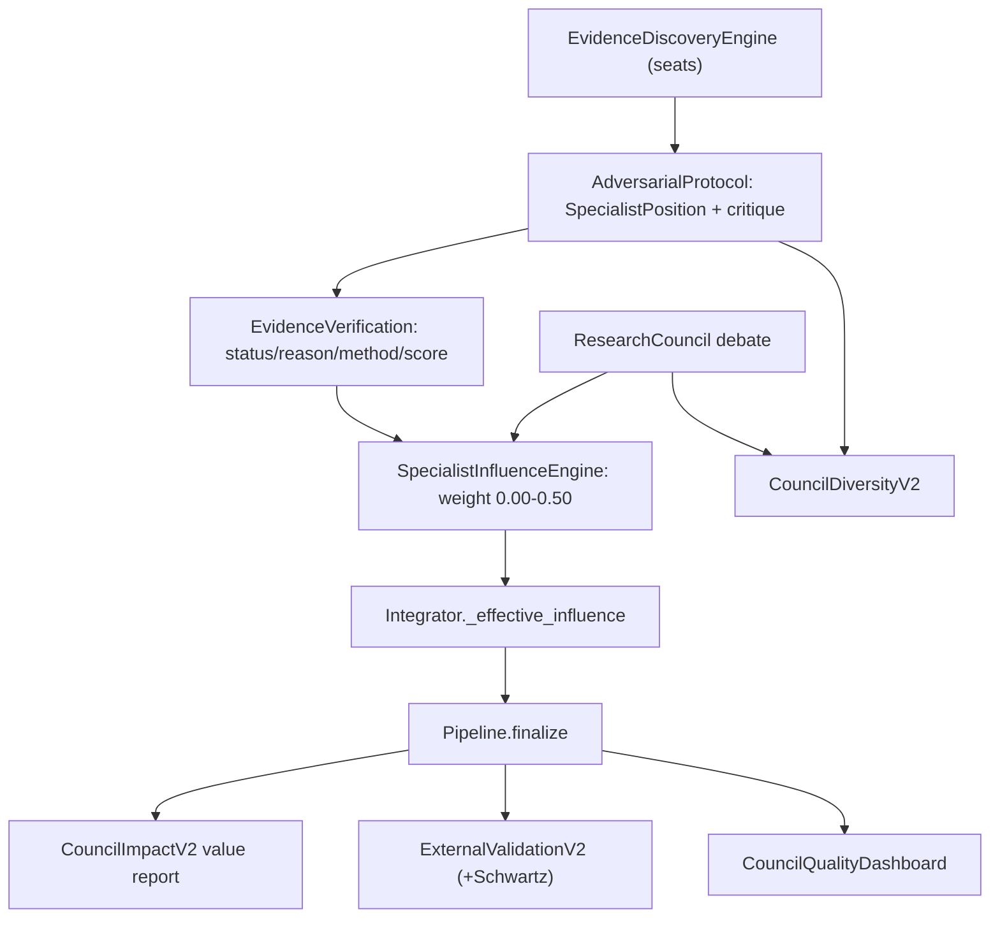

## FOLK Council Intelligence Upgrade

Targets BOTH specialist layers (web research seats + council agents), and feeds a unified influence weight into the integrator only. Scoring math, calibration, CI generation, anchors, and existing exports are untouched.

### Constraints honored
- Integrator change is limited to `_effective_influence` (the influence weight). The blend `baseline + influence * (consensus - baseline)`, `_clamp`, anchor locks, calibration, and CI logic stay exactly as in [src/folk/integrator/engine.py](src/folk/integrator/engine.py) lines 105-134.
- All new outputs are additive. `export_all` keeps every current key; new files are appended.

### Data flow (new pieces in bold)

### 1. New / extended data models (`src/folk/models/`)
- New `models/influence.py`: `SpecialistInfluenceRecord` (iso3, dimension, baseline_score, specialist_recommendation, specialist_confidence, evidence_strength, evidence_quality, disagreement_index, specialist_influence_weight 0.00-0.50, rationale).
- New `models/adversarial.py`: `SpecialistPosition` (iso3, seat/agent, dimension, strongest_supporting, strongest_opposing, biggest_weakness, alternative_score, confidence); `SpecialistChallengeRecord` (challenger, target, dimension, attack_type in {assumptions, evidence_quality, framework_interpretation, missing_evidence}, critique, target_response, accepted, impact).
- New `models/diversity.py`: `CouncilDiversityV2` (iso3, score_diversity, source_diversity, reasoning_diversity, challenge_intensity, consensus_quality). Existing `CouncilDiversityReport` is kept.
- Extend `models/impact.py`: add `CouncilImpactV2` (score_change_pct, outlier_reduction, regional_coherence_improvement, framework_conflict_reduction, review_queue_reduction, council_value_score, verdict).
- Extend `models/external.py`: add `ExternalValidationV2` wrapper that reuses `CorrelationResult` and adds Schwartz comparisons; keep `ExternalValidationReport`.
- Section 6 in `models/research.py`: new enum `EvidenceVerificationStatus` (VERIFIED, PARTIALLY_VERIFIED, UNVERIFIED) in `models/enums.py`; add `verification_reason`, `verification_method`, `verification_score` to `EvidenceSource` (lines 93-106); new `EvidenceIntelligenceRecord` embedding these, attached to `DimensionEvidenceIntelligence`/`EvidenceIntelligenceReport` (lines 299-317). Existing `VerificationStatus` (URL outcome) is preserved.
- New `models/dashboard.py`: `CouncilQualityDashboard` (specialist_influence_pct, disagreement_rate, challenge_intensity, evidence_quality, evidence_diversity, council_value_score, external_validation_score, targets_met dict).
- Register all new models in [src/folk/models/__init__.py](src/folk/models/__init__.py).
- Add audit fields in [src/folk/models/audit.py](src/folk/models/audit.py) and profile fields in [src/folk/models/profile.py](src/folk/models/profile.py) to store influence records, positions, challenges, and diversity_v2 for full auditability.

### 2. Specialist Influence Engine (Section 1)
- New `src/folk/influence/engine.py`: `SpecialistInfluenceEngine.compute(pack, assessments, disagreement, evidence)` returns `dict[Dimension, SpecialistInfluenceRecord]`. Weight formula combines evidence_strength, evidence_quality, specialist_confidence and disagreement_index, clamped to [0.00, 0.50]; weak evidence lowers it.
- Wire in [src/folk/pipeline/processor.py](src/folk/pipeline/processor.py) right after `specialist_disagreement(...)`; pass the per-dimension weight into `integrator.integrate(...)`.
- In [src/folk/integrator/engine.py](src/folk/integrator/engine.py), change only `_effective_influence` (lines 55-68) to use the specialist_influence_weight (cap 0.50) instead of `base + dis*bonus`; everything downstream unchanged.

### 3. Adversarial Research Protocol (Section 2)
- New `src/folk/research/adversarial.py`: build a `SpecialistPosition` per seat/dimension from the evidence ledgers (`build_ledgers` in [src/folk/research/synthesis.py](src/folk/research/synthesis.py)), then a critique pass producing `SpecialistChallengeRecord`s. Reuse the council critique ring concept in [src/folk/council/orchestrator.py](src/folk/council/orchestrator.py) (`_build_challenges`, lines 117-150) to also emit attack_type-tagged challenges for council agents.
- Invoke in `processor.process()` between discovery and council; store on profile/audit.

### 4. Diversity V2 (Section 3)
- New `src/folk/analysis/diversity.py`: `CouncilDiversityV2Builder` computing score_diversity (reuse council pstdev from `_diversity`), source_diversity (distinct `SourceCategory`/providers across `EvidenceSource`), reasoning_diversity (distinct seat `reasoning_style` from `SEAT_PERSONAS`), challenge_intensity (count/impact of `SpecialistChallengeRecord`), consensus_quality (post-debate agreement). Target reasoning_diversity > 0.5.

### 5. Council Value Measurement (Section 4)
- Extend [src/folk/analysis/impact.py](src/folk/analysis/impact.py) with `council_impact_v2(...)` reusing the existing baseline-vs-council counterfactual machinery (`_baseline_vectors`, `_quality`, lines 154-223) to produce `CouncilImpactV2`. New export `folk_council_value_report.json`.

### 6. External Validation V2 + scipy (Section 5)
- Add Schwartz comparison rows to `_COMPARISONS` in [src/folk/validation_engine/external.py](src/folk/validation_engine/external.py) (lines 32-49) mapped to available Schwartz columns, and a `validate_v2` returning `ExternalValidationV2`. New export `folk_external_validation_v2.json`. Existing report/export kept.
- Move `scipy>=1.11` from optional `[stats]` to core dependencies in [pyproject.toml](pyproject.toml); the NumPy fallback stays as defense.

### 7. Evidence Verification Layer (Section 6)
- Upgrade `score_source` in [src/folk/research/verification.py](src/folk/research/verification.py) (lines 64-72) to also set `verification_status` (3-state evidence grade), `verification_reason`, `verification_method` (url_check | provider_native | knowledge_only), and `verification_score`. Map URL `UNREACHABLE`/recency to PARTIALLY_VERIFIED.

### 8. Quality Dashboard + wiring + exports (Section 7)
- New `src/folk/analysis/dashboard.py`: `CouncilQualityDashboardBuilder.build(report, profiles)` aggregating specialist influence %, disagreement rate, challenge intensity, evidence quality/diversity, council value, external validation; flags targets (influence > 25%, reasoning_diversity > 0.5, external available, council value measurable, review queue < 10%).
- Attach V2 outputs in `Pipeline._attach_phase2_analytics` ([src/folk/pipeline/pipeline.py](src/folk/pipeline/pipeline.py) lines 214-231) onto `ValidationReport`.
- Add exporter methods in [src/folk/export/exporter.py](src/folk/export/exporter.py) for `folk_council_value_report.json`, `folk_external_validation_v2.json`, `folk_council_quality_dashboard.json`; append keys to `export_all` (lines 30-54). Add an Excel sheet/file for influence + dashboard; SQLite persistence is automatic via `repos.validations.save` of the enriched `ValidationReport`.
- Add tuning fields to [src/folk/config/settings.py](src/folk/config/settings.py) (lines 82-88): `specialist_influence_max: float = 0.50`, weight component weights, and an `enable_adversarial_protocol` flag.

### 9. Tests
- Update [tests/test_council_integrator.py](tests/test_council_integrator.py) for the new influence source; add tests for influence weight bounds, adversarial positions/challenges, diversity V2 (reasoning > 0.5), council value, external V2 Schwartz, evidence verification 3-state, and dashboard targets.

### Verification
- Run `folk run --limit 5` (mock mode) and confirm all existing `outputs/folk_*` files are unchanged in shape plus the three new JSON files appear; run `pytest`.