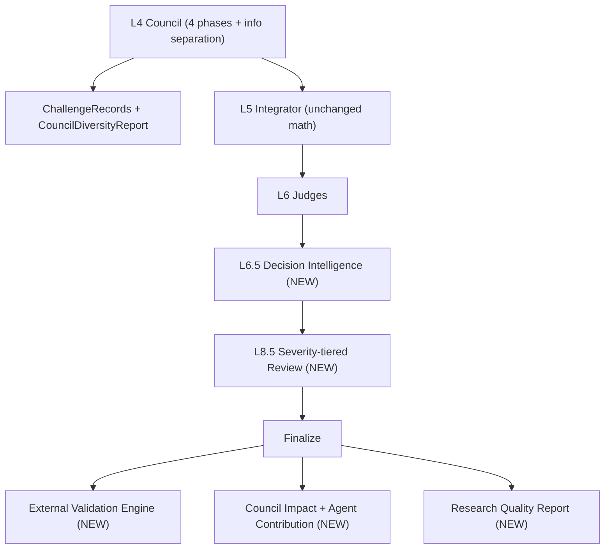

# FOLK Phase 2 - Scientific Quality & Explainability Upgrade

## Guardrails (frozen - do NOT touch)
- Integrator final-score math, `clamp_to_ci_int`, anchor locks ([src/folk/integrator/engine.py](src/folk/integrator/engine.py), [src/folk/scoring.py](src/folk/scoring.py), [src/folk/anchors.py](src/folk/anchors.py))
- `CountryCalibrator` / `GlobalCalibrator` math, `ConstructedCI` generation ([src/folk/calibration/country.py](src/folk/calibration/country.py))
- `ConfidenceEngine` math ([src/folk/confidence/engine.py](src/folk/confidence/engine.py))
- The Excel baseline dataset / loader output ([src/folk/data/loader.py](src/folk/data/loader.py))

Objective 3 changes *deliberation behaviour* (what agents see + a new critique round); the integration math that turns Phase-final positions into scores stays identical. Per your choices: explanations + reports are **LLM-generated prose** (deterministic hint + live LLM, mock-safe), and the cross-critique is a **genuine extra LLM round**.

## New data flow

## Objective 1 - Decision Intelligence Layer
- Add enums to [src/folk/models/enums.py](src/folk/models/enums.py): `AdjustmentType` (NO_CHANGE / ROUNDING / ANCHOR_ALIGNMENT / REGIONAL_ALIGNMENT / FRAMEWORK_CONFLICT_RESOLUTION / EVIDENCE_CORRECTION / CALIBRATION_ADJUSTMENT / OUTLIER_CORRECTION / CONFIDENCE_ADJUSTMENT) and `ReviewSeverity` (LOW/MEDIUM/HIGH).
- New `src/folk/models/decision.py`: `FrameworkContribution` (dict summing to 100, validator normalizes), `DecisionCounterfactual` (selected_score, considered_alternatives, why_rejected, why_selected), `DecisionExplanation` (all required fields).
- New `src/folk/decision/engine.py` - `DecisionEngine.explain(record, pack, integ, council, judges, conf, cal)`:
  - Per `country x dimension`, build a deterministic hint from existing audit data: `baseline_score`/`final_score`/`change_amount`/`change_percent`; per-agent reasoning pulled from `council.final_positions[role].scores[d].rationale`; `integrator_decision` from `integ.adjustment_log`; `judge_validation` from `judges`; `calibration_effect`/`confidence_explanation` from `cal`/`conf`; `supporting_frameworks`/`conflicting_frameworks` from `pack.framework_signals[d]`.
  - `FrameworkContribution` derived from `framework_coverage` + per-framework signal weights (normalized to 100).
  - `DecisionCounterfactual` alternatives = distinct Phase-final per-agent scores + baseline; why_selected/why_rejected from confidence-weighting + CI bounds.
  - `AdjustmentType` classifier (deterministic rules using anchor locks, regional mean, framework conflict score, outlier flag, ci/midpoint flags).
  - **Mandatory rule:** if `abs(final-baseline) >= 2`, fill prose fields via `provider.generate_structured(DecisionExplanation, ...)` (provider mapped to `integrator`/anthropic). Else set `adjustment_type=ROUNDING` and emit a short deterministic explanation (no LLM call - saves cost).
- Attach `decision_explanations: list[DecisionExplanation]` to `CountryProfile` ([src/folk/models/profile.py](src/folk/models/profile.py)) and `AuditTrace`; wire generation into [src/folk/pipeline/processor.py](src/folk/pipeline/processor.py) after judges/confidence.

## Objective 2 - Reduce human review queue
- Rebuild [src/folk/review/queue.py](src/folk/review/queue.py): each reason gets a `ReviewSeverity`. HIGH (anchor violation, CI violation, judge rejection, severe narrative inconsistency, discriminant failure) -> `requires_human_review=True`. MEDIUM (moderate narrative uncertainty, moderate framework conflict) -> new `advisory` list only. LOW (midpoint warning, anchor midpoint, weak flat profile) -> informational, not queued.
- Add `advisory_queue: list[HumanReviewItem]` to [src/folk/models/validation.py](src/folk/models/validation.py) and `review_severity` to the profile; aggregate in `Pipeline.finalize` ([src/folk/pipeline/pipeline.py](src/folk/pipeline/pipeline.py)).
- **Midpoint rebuild:** new `src/folk/review/midpoint.py` - `MidpointConfidenceScore` from (distance from 50, framework agreement, evidence strength, confidence level, agent variance). Trigger midpoint *review* only when `near 50 AND agreement low AND confidence != HIGH AND not anchor country`. This gates the *review trigger* in the review layer; `CalibrationResult.midpoint_dimensions` raw detection stays untouched (frozen calibration math).

## Objective 3 - Council independence + adversarial deliberation
- Information separation in [src/folk/council/agents.py](src/folk/council/agents.py) `_build_user`: per-role context filter. Statistician sees framework scores/CIs/signal strength only; Comparativist sees regional clusters/neighbours/anchors only; Country Specialist sees country evidence/history/qualitative refs only; Skeptic (Devil's Advocate) sees all outputs. Keep deterministic `_compute` hints unchanged so mock mode stays stable.
- Restructure [src/folk/council/orchestrator.py](src/folk/council/orchestrator.py) into 4 named phases: P1 Independent, **P2 Cross-Critique (new LLM round, each agent critiques another)**, P3 Revision, P4 Consensus. Add `CouncilResult.final_positions` property (= phase4) and update all readers (`integrator._dissent/_constructed_ci`, `processor` confidence `by_dim`, `_enforce_ci`) to use it - integration math unchanged.
- Add `ChallengeRecord` (challenger, target, claim, critique, accepted, rejected, impact) and `CouncilDiversityReport` (dimension, score_std, max_difference, disagreement_index, consensus_strength, tracked before/after consensus) to [src/folk/models/council.py](src/folk/models/council.py); store on `AuditTrace`.

## Objective 4 - External validation engine
- New `src/folk/validation_engine/external.py` - `ExternalValidationEngine.validate(profiles, records)` computing Pearson + Spearman + rank-agreement across base countries between FOLK final D-scores and raw framework columns from `CountryRecord.framework_scores`:
  - Hofstede: D1 vs `hofstede_individualism`, D3 vs `hofstede_uncertainty_avoidance`, D4 vs `hofstede_masculinity`.
  - GLOBE: D4 vs `globe_performance_orientation`, D1 vs `globe_institutional_collectivism`.
  - WVS: best-available proxies for Traditional/Secular and Self-Expression (the dataset's WVS columns are `wvs_defiance/disbelief/scepticism` and `wvs_autonomy/choice/voice`, not the literal Inglehart axes) - composite proxies, flagged as approximate in the report.
- New model `src/folk/models/external.py` (`CorrelationResult`, `ExternalValidationReport`). Use `scipy.stats` if available, else a NumPy/pure-Python Pearson+Spearman fallback (add `scipy` to `pyproject` optional deps).

## Objective 5 - Council impact analysis
- New `src/folk/analysis/impact.py`:
  - `CouncilImpactReport`: per-country `delta_D1..delta_D4` (final - baseline) + aggregates (countries_changed, average/median/largest adjustment, dimension_adjustment_rates).
  - `AgentContributionReport`: from `dissent_record` + `adjustment_log` + `ChallengeRecords` -> adjustments_proposed/accepted/rejected, average_score_change, impact_score per agent.
  - **Counterfactual pipeline** WITHOUT_COUNCIL (baseline vectors + anchor locks + CI clamp only) vs WITH_COUNCIL (final): reuse `CountryCalibrator`/`GlobalCalibrator` read-only to compare anchor_violations, regional_coherence, outlier_count, review_queue_size, validation_score, external_correlation; emit "did the council improve, by how much".
- New models in `src/folk/models/impact.py`.

## Objective 6 - Research quality report
- New `src/folk/analysis/quality.py` - `ResearchQualityReport` aggregating Human Review %, Midpoint Review %, Narrative Failure %, Judge Disagreement %, Agent Variance, Calibration Pass %, Anchor Compliance %, External Correlation, Council Impact Score; `overall_grade` A+/A/B/C via thresholds tied to the success criteria.

## Exports, CLI, settings, tests
- Extend [src/folk/export/exporter.py](src/folk/export/exporter.py) with: `folk_decision_explanations.json`, `folk_external_validation_report.json`, `folk_council_impact_report.json`, `folk_agent_contribution_report.json`, `folk_council_diversity_report.json`, `folk_research_quality_report.json/.txt`; add advisory queue + severities to the TXT report.
- Wire new finalize-stage engines into `Pipeline.finalize` and surface them in `ValidationReport`; add a `folk quality` CLI subcommand ([src/folk/cli.py](src/folk/cli.py)) to re-emit reports from the DB.
- Add tunables to [src/folk/config/settings.py](src/folk/config/settings.py): severity thresholds, midpoint-confidence gates, grade boundaries.
- Tests (mock provider) under `tests/`: `test_decision_engine.py`, `test_review_severity.py`, `test_midpoint_detector.py`, `test_council_independence.py`, `test_external_validation.py`, `test_council_impact.py`, `test_research_quality.py`. Run full `pytest` (mock mode) to confirm no regression of frozen behaviour.