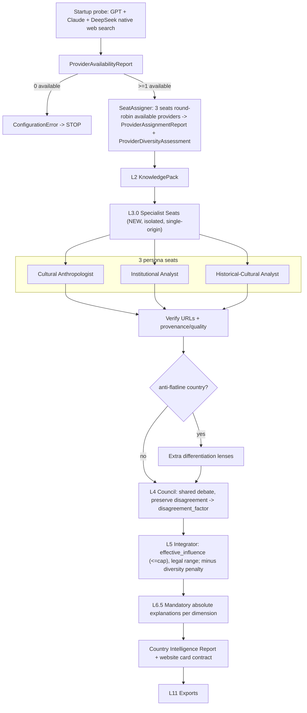

# Web-Enabled Cultural Intelligence Council

Final product requirements supersede earlier assumptions on conflict. Two fallback concepts are now explicitly distinguished:
- **Search-backend fallback: BANNED.** No external/shared search engine, ever. Each `SpecialistEvidencePack` is single-origin (only the provider that produced it, via its native web research).
- **Specialist-slot (provider) fallback: REQUIRED.** Three persona SEATS always stay filled; if a preferred provider is down, its seat is reassigned to another available provider. The run fails only when **no** provider is available.

## Core principles
- **3 persona seats, not 3 providers** (Req 1, refined): seats = Cultural Anthropologist, Institutional Analyst, Historical-Cultural Analyst; each first-class, proposing scores + evidence + cultural rationale + confidence. Disagreement preserved (no early convergence).
- **Slot fallback preserves debate diversity**: seats prefer GPT/Claude/DeepSeek; on outage, round-robin available providers (same seat, same persona prompt, different provider) so there are always 3 independent voices.
- **Provider-diversity penalty**: `provider_diversity = unique_providers / 3`; a small confidence penalty when < 3 unique providers.
- **Disagreement increases specialist influence** (Req 2), within the legal range (Req 8).
- **Broad, quality-weighted evidence** (Req 3); **anti-flatline** within bounds (Req 4); **mandatory absolute explanations** (Req 5); **Country Intelligence Report + website cards** (Req 6, 7).

## Provider-native research (verified Jun 2026)
- **OpenAI**: `web_search` via Responses API (new surface vs `chat.completions` in [src/folk/llm/providers.py](src/folk/llm/providers.py)).
- **Anthropic**: `web_search_20250305`/`web_search_20260209` Messages server tool.
- **DeepSeek**: native search only via Anthropic endpoint `https://api.deepseek.com/anthropic`; if unavailable, DeepSeek is simply marked unavailable and its seats reassign (no search substitution).

## Data flow

## 1 - ResearchProvider + native search (no search fallback)
- New [src/folk/research/providers.py](src/folk/research/providers.py): `BaseResearchProvider.research(...)` owning query gen -> discovery -> extraction -> citations -> confidence. `OpenAIResearchProvider` (Responses `web_search`), `AnthropicResearchProvider` (Messages `web_search`), `DeepSeekResearchProvider` (Anthropic endpoint), `DeterministicResearchProvider` (**mock only**).
- New [src/folk/research/errors.py](src/folk/research/errors.py) `ResearchCapabilityError` (a `ConfigurationError`). The factory never swaps the SEARCH backend; a provider that lacks key / unsupported model / unavailable search / blocking rate-limit is marked **provider-unavailable** (feeding seat reassignment), not silently substituted with another search engine.

## 2 - Specialist seats + slot fallback (Req 1, refined)
- New [src/folk/research/seats.py](src/folk/research/seats.py): `SPECIALIST_SLOTS = [CulturalAnthropologist, InstitutionalAnalyst, HistoricalAnalyst]`. Each seat has a **distinct system prompt, research strategy, evidence-weighting profile, and reasoning style** (anthropologist: traditions/norms/ethnography/identity; institutional: government/education/workplace/legal; historical: history/migration/religion/colonial). Distinct prompts live alongside the existing prompt library.
- `SeatAssigner.assign(available_providers)`: preferred order GPT, Claude, DeepSeek; round-robin across **available** providers so all 3 seats fill (e.g. DeepSeek down -> Slot1=GPT, Slot2=Claude, Slot3=GPT, each with its own persona prompt). Never duplicate identical prompts. Emits `ProviderAssignmentReport`.
- Each seat -> a `SpecialistEvidencePack` + `SpecialistAssessment` (per-dimension proposed_score, supporting/counter evidence, cultural_rationale, confidence). Single-origin per pack preserved; isolated discovery (no seat sees another). The 3 seats' proposed scores seed the L4 debate and define `disagreement_factor`.

## 3 - Startup validation + diversity (relaxed fail rule)
- [src/folk/research/validation.py](src/folk/research/validation.py) `validate_research_capability(settings)`: probe each provider's native web search once -> `ProviderAvailabilityReport` (per provider: available bool + reason). Then `SeatAssigner` fills seats and computes `provider_diversity = unique_providers/3` -> `ProviderDiversityAssessment`.
- **Fail only when zero providers are available** (`ConfigurationError`, naming each unavailable provider + reason). With >=1 available, proceed with slot fallback; apply a small bounded confidence penalty when diversity < 1.0. Wired at top of `Pipeline.run` ([src/folk/pipeline/pipeline.py](src/folk/pipeline/pipeline.py)) and `folk research --validate` ([src/folk/cli.py](src/folk/cli.py)); skipped in mock mode (all "available", diversity 1.0).
- Diversity penalty applied as a capped post-hoc reduction in confidence ([src/folk/confidence/engine.py](src/folk/confidence/engine.py) consumer side) - a deliberate, bounded addition recorded in the assessment (does not alter the frozen core confidence factor math beyond this explicit penalty term).

## 4 - Broad, quality-weighted evidence (Req 3)
- `SourceCategory` enum in [src/folk/models/enums.py](src/folk/models/enums.py): peer_reviewed_paper, book, ethnography, biography, historical_text, government_publication, census_report, oecd_report, un_report, world_bank_report, think_tank, expert_essay, cultural_blog, long_form_journalism, local_language_source, country_specific_literature - mapped to existing `SourceType`. Tiered `source_quality` adjusted by recency + `VerificationStatus`; low quality down-weights but is never excluded.

## 5 - Anti-flatline investigation (Req 4)
- `anti_flatline_isos` in [src/folk/config/settings.py](src/folk/config/settings.py): TZA, TJK, FJI, OMN, HND, KEN, DOM, SYR, BIH, SLE, BFA, LUX, POL, MAR, BTN, MNG, QAT, AUT, KAZ, VNM, ZMB, GEO, MYS, MWI, MMR. These get extra differentiation lenses + a within-CI `differentiation_check`; allow wider dimension spread only inside the legal range, else flag for review. Never touches frozen calibration math; `flat_profile` detection stays.

## 6 - Integrator: dynamic, disagreement-scaled influence (Req 2, 8)
- [src/folk/integrator/engine.py](src/folk/integrator/engine.py) `_compute`: `disagreement_factor` (0-1) from the 3 seats' per-dimension score spread (reuse `CouncilDiversityReport`). `effective_influence = min(council_influence_max, base_influence + disagreement_factor * specialist_bonus)`. `final = clamp(baseline + effective_influence * (consensus - baseline))`; CI + score bounds clamp, anchor locks override, calibration + global stay outer rails. Defaults `base_influence=0.4`, `specialist_bonus=0.4`, `council_influence_max=0.75` (config). Record influence + cap in `AdjustmentLog`/`DissentRecord`.

## 7 - Mandatory absolute explanations (Req 5)
- Extend `DecisionExplanation` ([src/folk/models/decision.py](src/folk/models/decision.py)) with `absolute_score_rationale` + `cultural_interpretation`; in [src/folk/decision/engine.py](src/folk/decision/engine.py) make these mandatory for **every** dimension ("why 72 and not 55/65/80/90" + cultural meaning), LLM-enriched in live mode for all dimensions, deterministic baseline in mock.

## 8 - Country Intelligence Report + website contract (Req 6, 7)
- New `CountryIntelligenceReport` (end-user prose) in [src/folk/research/report.py](src/folk/research/report.py): Country Summary; per-dimension (final score, confidence, absolute explanation, supporting + counter evidence, specialist disagreements, final rationale); Specialist Debate Summary; Key Cultural Drivers; Most Important Sources; Comparison to Neighbours; Comparison to Global Average; Confidence Assessment. Exported JSON + markdown.
- Website contract `folk_country_intelligence.json`: per dimension Score, Confidence, Trend, Evidence Strength, Specialist Agreement, Top Supporting/Counter Arguments, Why This Score, Why Not Higher/Lower, Related Countries, Key Sources. **Separable track (stack TBD):** Bloomberg-terminal-style dashboard (proposed static React/Vite under `web/`); default ships the contract now.

## 9 - Models, exports, CLI, settings
- New [src/folk/models/research.py](src/folk/models/research.py): `EvidenceSource`, `EvidenceClaim`, `EvidenceCitation`, `SpecialistEvidencePack`, `SpecialistAssessment`, `SupportingEvidence`, `CounterEvidence`, `EvidenceIntelligenceReport`, `CountryIntelligenceReport`, `ProviderAvailabilityReport`, `ProviderAssignmentReport`, `ProviderDiversityAssessment`; register in [src/folk/models/__init__.py](src/folk/models/__init__.py). Attach to [src/folk/models/profile.py](src/folk/models/profile.py) + `AuditTrace` ([src/folk/models/audit.py](src/folk/models/audit.py)); wire into [src/folk/pipeline/processor.py](src/folk/pipeline/processor.py).
- [src/folk/export/exporter.py](src/folk/export/exporter.py): evidence packs, evidence sources, evidence intelligence report, country intelligence report (+md), website card contract, plus provider availability/assignment/diversity reports.
- [src/folk/cli.py](src/folk/cli.py): `research --validate`; evidence/report re-emit. [src/folk/config/settings.py](src/folk/config/settings.py): research mode/keys, native-search toggles + `max_uses`, seat personas + preferred provider order, `base_influence`/`specialist_bonus`/`council_influence_max`, `diversity_penalty`, `anti_flatline_isos`, quality weights, timeouts. [pyproject.toml](pyproject.toml): `openai>=1.50` + web-capable `anthropic`; NO search dep.

## 10 - Tests + revalidation (mock mode)
- New tests: isolated single-origin seats; **slot fallback** (DeepSeek down -> 3 seats, providers [GPT, Claude, GPT], distinct persona prompts); `provider_diversity` math + bounded confidence penalty; **fail only when all providers down**; disagreement preserved; dynamic influence rises with disagreement but never exceeds `council_influence_max` nor breaches CI/anchor; anti-flatline within CI (flags when too tight); mandatory absolute explanation for all 4 dimensions; CountryIntelligenceReport + website-contract completeness; startup-validation reasons surfaced.
- Re-run full `pytest` + `folk calibrate`: anchors stay locked (KOR_d1=50, TUR_d2/d4=50, COL_d3=50); dynamic blend + anti-flatline shift non-anchor scores - update `test_judges_calibration_confidence`/`test_narrative` and re-verify reference-country ranges.

## Risks, limitations, cost
- **Robust continuity**: slot fallback keeps the 197-country run alive through single-provider outages; only a total outage stops it. Trade-off surfaced via the diversity penalty (lower confidence when < 3 unique providers).
- **Single-origin intact**: reassigned seats still do native research from one provider; no search-backend mixing.
- **OpenAI Responses surface**: new path; 128K web-search context cap; avoid deprecated preview search models.
- **DeepSeek**: search only on the Anthropic endpoint, historically under-documented; if unavailable its seats reassign automatically.
- **Cost up sharply**: 3 seats x native web search (per-search surcharges + tokens) x 197, plus absolute explanations LLM-enriched for every dimension. Bound via `max_uses`/result caps/per-provider toggles.
- **Non-determinism**: live web research varies run-to-run; reproducibility only in mock mode; affects resume.
- **Anti-flatline vs CI**: genuine differentiation can exceed a compressed CI -> flag for review, never breach the legal range.
- **Website scope**: full dashboard is a separate frontend track with its own stack decision; default ships the JSON contract.
